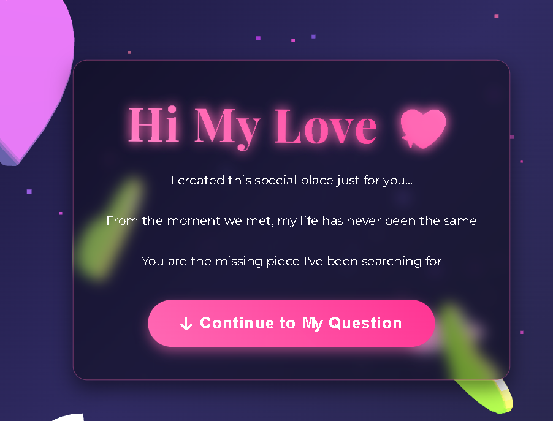
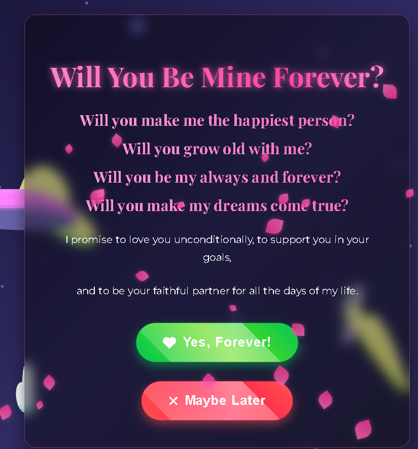

# PROPOSSAL-WESBITE
This is a romantic interactive webpage created with love and hope.

````markdown
# 💖 Proposal Website

This is a romantic interactive **proposal website** built with **HTML, CSS, and JavaScript (Three.js + animations)**.  
It creates a magical atmosphere with floating hearts, petals, confetti, and a special question:

> **"Will You Marry Me?"**

---

## 🌹 About

💌 I built this for someone who meant the world to me.
But sometimes… love doesn’t come back the way we give it. 💔

I lost the one I loved, yet through this project, a part of that love still lives.
Maybe it couldn’t be our story, but it can still become your story.

Take this, shape it with your own feelings, and let it be the bridge to someone’s heart.
Because even if I couldn’t keep mine, I hope you can create a memory that lasts forever. ✨❤️
---

## ✨ Features

- 🎨 Elegant design with glowing text, gradients, and animations.  
- 💎 Interactive buttons ("Yes, Forever!" / "Maybe Later").  
- 🌸 Falling petals & confetti effects.  
- 🎶 Background romantic music.  
- 💍 Ring animation on "Yes".  
- 📜 Proposal messages that appear one by one.  
- 🔘 Smooth navigation & progress bar.

---

## 🚀 Getting Started

1. Clone this repo:
   ```bash
   git clone https://github.com/kredix-xypher/PROPOSSAL-WESBITE.git
````

2. Open `index.html` in your browser.
3. Customize the text and music if you like.
4. Share it with the one you love ❤️

---

## 📸 Preview

  
  


---

## ❤️ Message

Even if love didn’t work out for me,
maybe it will for you.
Use this site to ask your most important question:

**“Will you be mine forever?”**

---

## 📜 License

This project is licensed under the **MIT License** — see the [LICENSE](./LICENSE) file for details.  

Spread love, always ❤️

